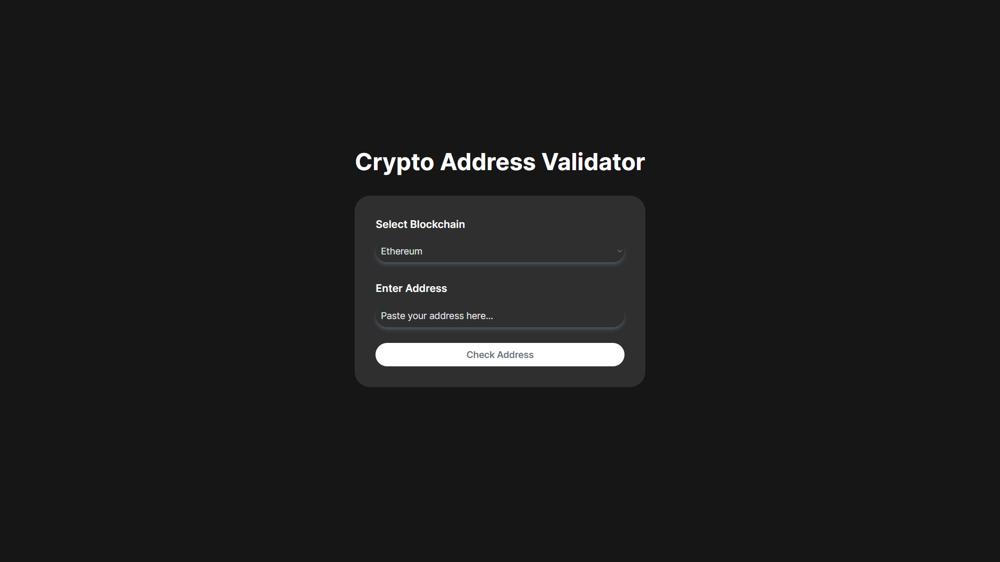

# Crypto Address Validator

This is a small project which validates different wallet addresses of various blockchains. The prime need was to collectively have a place where I can check whether the address I be sending funds to, is valid or not. Built with Next.js and Typescript!



## Installation

To install the project, clone the repository and run command: ```pnpm install```

## Usage

Simply select the blockchain you want to validate the address for and paste the address in the input field. The site will automatically validate the address and show the result.

## Contributing

Pull requests are welcome. For major changes, please open an issue first to discuss what you would like to change.
In order to contribute additional blockchain addresses, do check the previous format and create a pull request by validating the results thoroughly.
